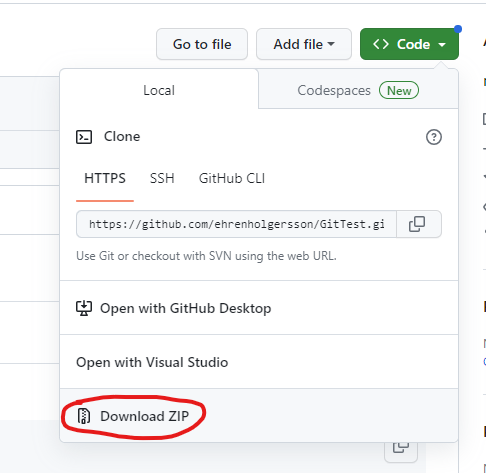
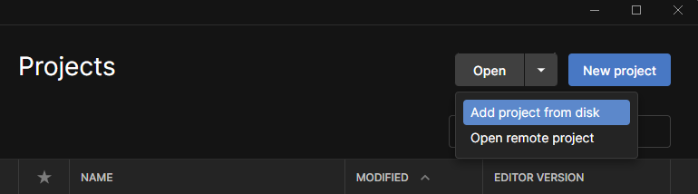

# Productive Bludgers Game Design Group Project
## Video On YouTube

## How to download and add as new Unity Project

<ol>

<li> Select the green "Code" button in above right corner and select "Download.zip"</li> 

<li> Extract the contents of the .zip onto a folder in you HDD</li> 

<li> Open Unity Hub</li> 

<li> In Unity Hub, click the down arrow next to the grey open button and select "Add project from disk"</li> 

<li> Select the folder you previously extracted the files to and click "Add Project"</li> 

<li> The Project should now appear in your projects list in Unity hub, click on it to open</li> 
</ol>

 
 
 
 

